# Hermes Dashboard Theme — Reflect

A premium dark theme for the [Hermes Agent](https://github.com/NousResearch/hermes-agent) web dashboard. Deep navy surfaces with indigo-violet accents, aurora bloom behind hero content, and subtle film grain for depth.

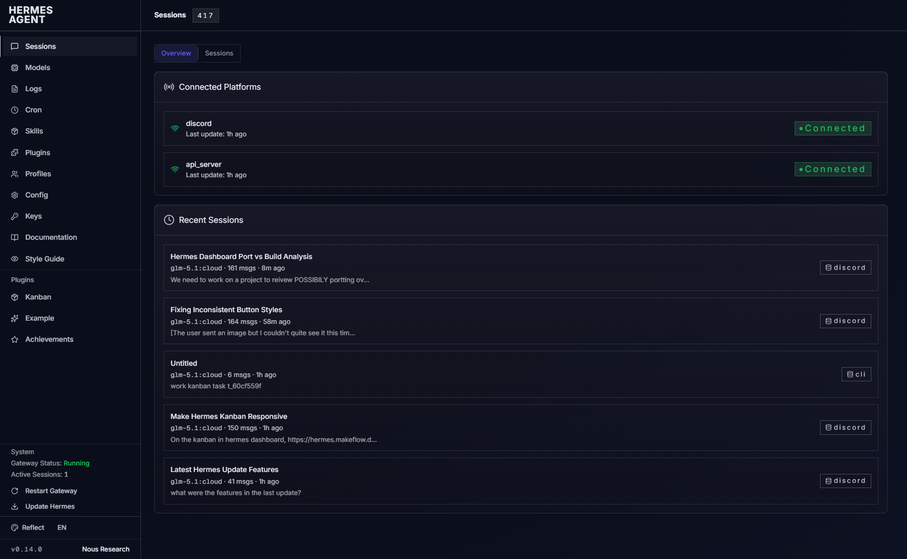

## Install

1. Download `reflect.yaml` into your dashboard themes directory:

```bash
mkdir -p ~/.hermes/dashboard-themes
curl -o ~/.hermes/dashboard-themes/reflect.yaml https://raw.githubusercontent.com/daletkc/hermes-theme-reflect/main/reflect.yaml
```

2. Select the theme in your dashboard — it appears as **"Reflect"** in the theme switcher immediately. No restart needed.

   Or set it via config:
   ```bash
   hermes config set dashboard.theme reflect
   ```

## Uninstall

```bash
rm ~/.hermes/dashboard-themes/reflect.yaml
```

Switch to a built-in theme first if Reflect was active:
```bash
hermes config set dashboard.theme default
```

## Screenshots

Live dashboard captures:

| | |
|---|---|
| 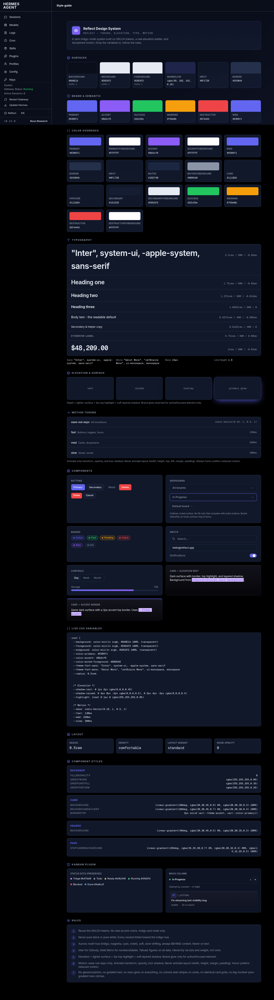 Style guide | 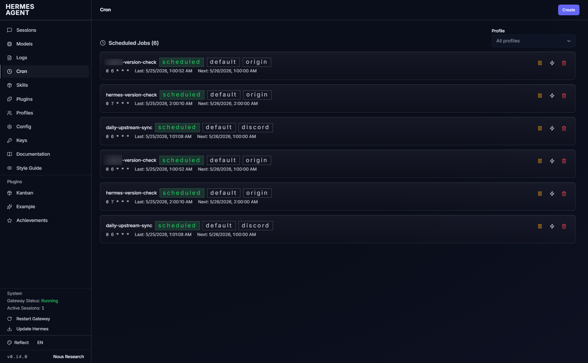 Cron |
| 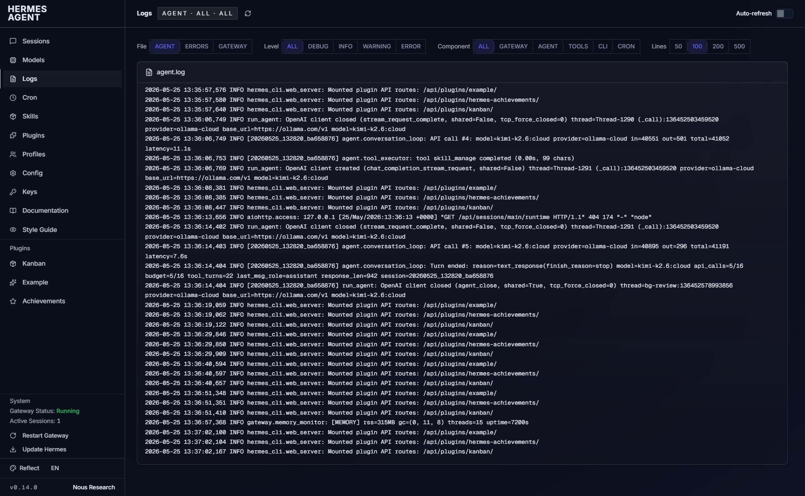 Logs | 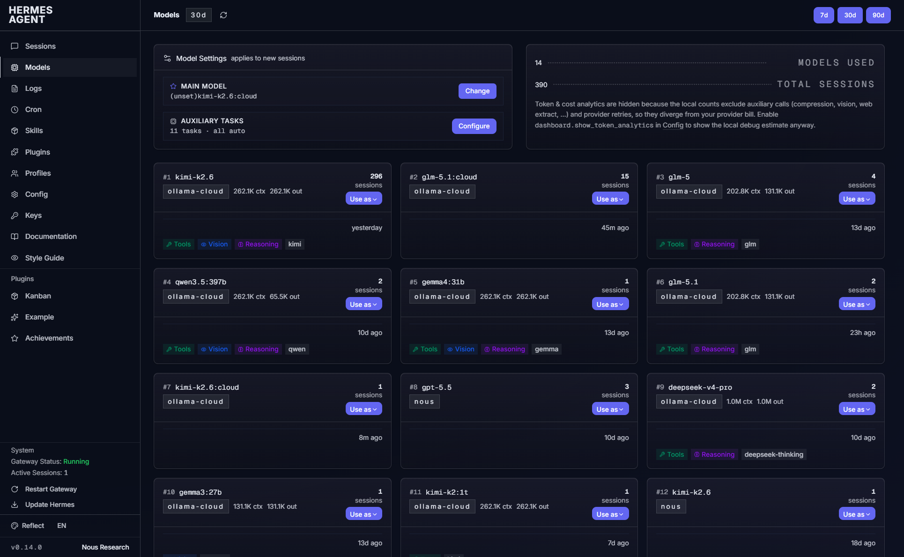 Models |
| 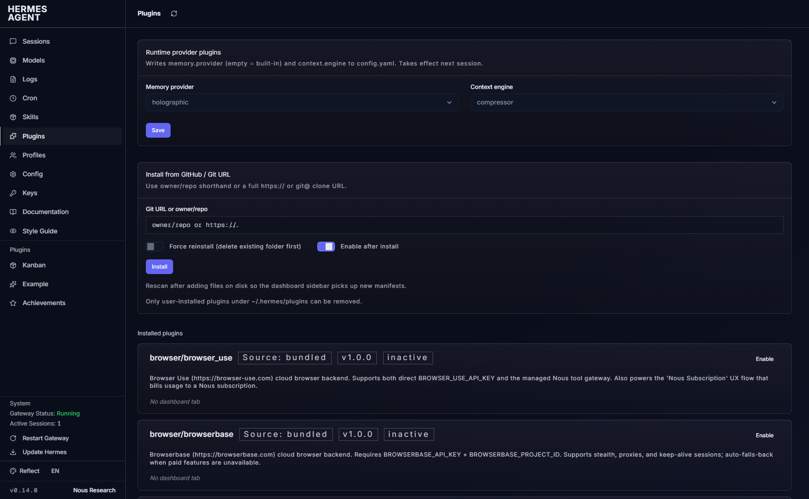 Plugins | 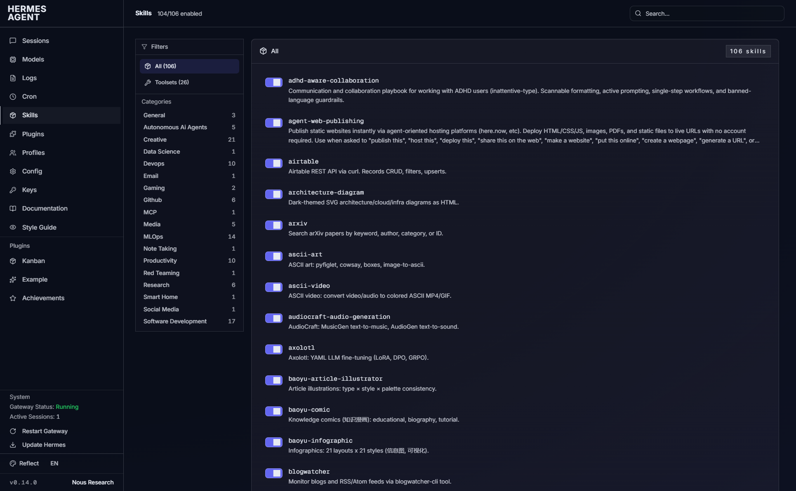 Skills |

Kanban board and task drawer screenshots are in the
[Kanban styling](#kanban-styling) section below.

## Design Language

| Token | Value | Usage |
|-------|-------|-------|
| Background | `#0A0E1A` | Page background |
| Surface 1 | `#11182A` | Cards, panels |
| Surface 2 | `#151D32` | Elevated surfaces |
| Surface 3 | `#1B2740` | Borders, dividers |
| Primary | `#6366f1` | Indigo — buttons, links, focus rings |
| Accent | `#8b5cf6` | Violet — highlights, hover states |
| Foreground | `#E6EAF2` | Primary text |
| Muted | `#8B95A8` | Secondary text |
| Font | Inter + Geist Mono | Body + monospace |

### Signature effects

- **Aurora bloom** — animated radial-gradient overlay on `body::before` using oklch color stops. Slow, subtle drift via CSS keyframes.
- **Film grain** — SVG noise texture on `body::after` at 3.5% opacity. Kills gradient banding on dark surfaces.
- **Glass cards** — Cards use gradient backgrounds with `backdrop-filter: blur(12px)` and inset top highlights.
- **Elevation on hover** — Cards lift 2px on hover with animated shadow transition.
- **Respects `prefers-reduced-motion`** — All animations and transitions are suppressed automatically.

### Kanban styling

The theme includes comprehensive overrides for the Hermes Kanban plugin, with a
task drawer modeled directly on **multica's issue detail view**
(`packages/views/issues`), mapped onto the Reflect palette.

**Board**

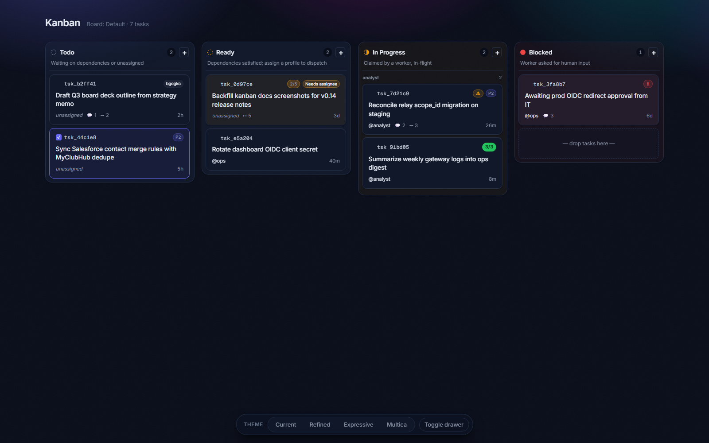

- **Status columns wrap into a responsive grid** (`auto-fill, minmax(280px, 1fr)`)
  instead of scrolling horizontally — every column stays in view
- Cards: single border + shadow hover response (no lift; cards are drag handles),
  task id anchored left with state chips docked right, bulk-select checkbox
  revealed on hover/selection, warning badges as amber/red severity chips
- Selected cards: one primary border + wash (no doubled inset rings)
- Outlined dropdown/select triggers; responsive single-column layout on mobile

**Task detail drawer (multica two-pane)**

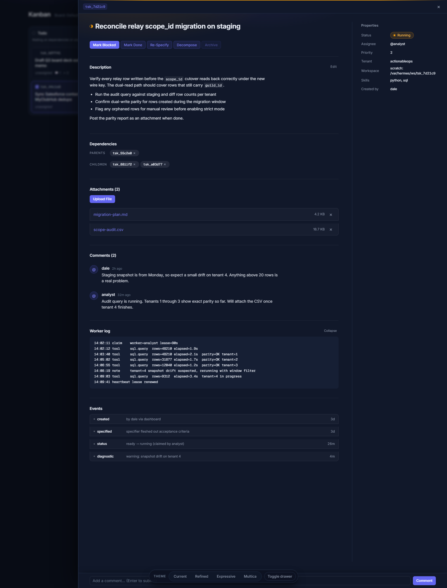
- Wide panel (up to `min(1320px, 94vw)`) split into a **document column
  (max 56rem) + 300px properties rail** behind a full-height hairline; the rail
  collapses back into the flow below 1100px
- **Status-aware accent** read from the title dot via `:has()`: a 2px keyline
  across the panel top, a status chip in the rail (amber running, red blocked),
  and a pulsing chip dot while the task runs
- **Unboxed description** in multica's compact prose tier (14px / 1.625,
  72ch measure) — the task reads as a document, not a stack of boxes
- Aurora echo behind the title that scrolls away with the content
- Attachments and events as **bordered record lists** with hairline dividers
  and full-row hovers; comments with generated avatar discs; worker log as a
  borderless muted mono block
- Action row with one primary action, tonal secondaries; Title Case labels;
  borderless pill dependency chips

**Before / after** (rendered from the bundled mockup at 1600px):

| Previous drawer | Multica drawer |
|---|---|
| 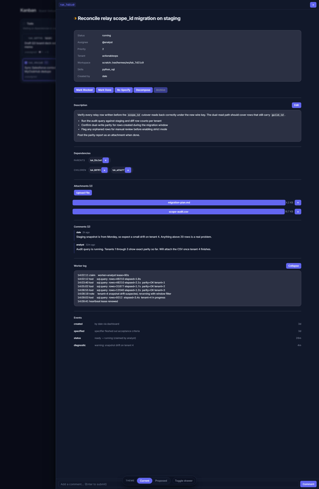 |  |

The `customCSS` block in `reflect.yaml` is assembled from two readable
fragments in [mockups/](mockups/): `reflect-global.css` + `reflect-kanban-final.css`.
An interactive before/after mockup lives at
[mockups/kanban-reflect-v2.html](mockups/kanban-reflect-v2.html)
(variants: Current / Refined / Expressive / Multica, plus `?variant=final`
to preview the exact shipped CSS). The board and drawer images above are
renders of that mockup — faithful markup + the shipped theme CSS — not live
dashboard captures.

### Dashboard-wide styling

The same language extends to every page (Sessions, Cron, Models, Skills,
Plugins, Channels, MCP, Webhooks, Pairing, Profiles, Config, Keys, System,
Analytics, Logs), with selector anchors verified against the compiled
design-system bundle:

- **Badges everywhere become quiet pills** — the DS ships every badge as a
  wide-tracked terminal chip (`s c h e d u l e d`); Reflect reshapes them to
  Inter, normal tracking, rounded-full, with semantic tones as soft washes
- **Filled-vs-outlined button state restored** (the Models period picker and
  friends) — outlined DS buttons render as quiet outlines that fill on hover
- **Toggle switches become standard pills** with round thumbs
- **Charts pick up the palette** via `--series-input-token` (indigo) and
  `--series-output-token` (emerald); the Dashboard hero reads
  `--theme-accent-secondary`, `--theme-text`, `--theme-card`, `--theme-border`
- **Log viewer**: debug dimmed, warning/error rows washed amber/red
- Translucent `bg-primary/10` washes (chat bubbles, primary badges) are no
  longer flattened to solid indigo

Survey mockup with a live current/proposed toggle:
[mockups/dashboard-reflect.html](mockups/dashboard-reflect.html) — six page
slices (Sessions, Cron, Models, Channels + Skills, Logs, Analytics).

| Current | Proposed (shipped) |
|---|---|
| 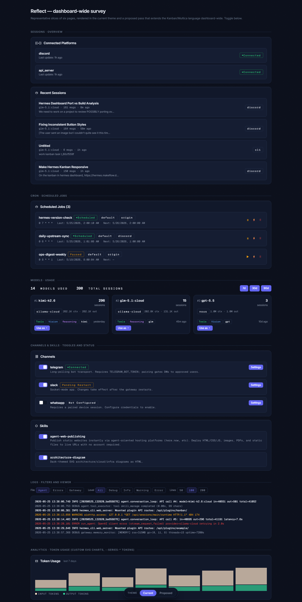 | 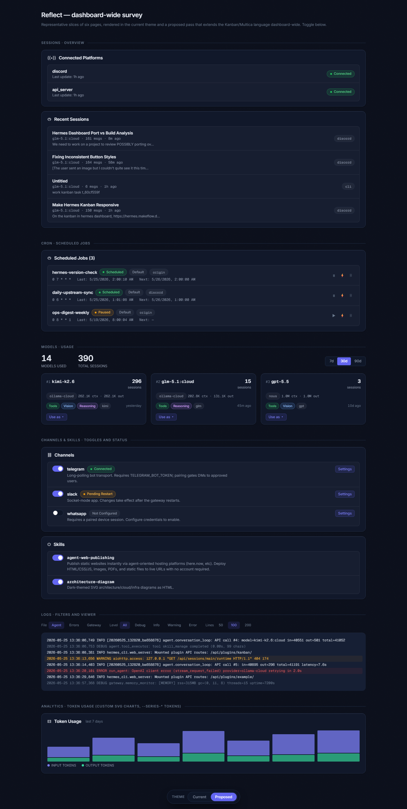 |

## Font Loading

The theme loads **Inter** (weights 300–700) and **Geist Mono** (weights 400–600) from Google Fonts via the `fontUrl` field. If you're running the dashboard behind a firewall without outbound internet:

1. Host the fonts locally on your reverse proxy
2. Update `fontUrl` in the YAML to point to your local font CSS

## Customization

The theme is a single YAML file. Edit it directly:

- **Palette**: Change `palette.background.hex`, `palette.foreground.hex`, etc.
- **Accent colors**: Change `colorOverrides.primary`, `colorOverrides.accent`
- **Aurora**: Modify the `customCSS` section — the `body::before` gradient block
- **Grain**: Adjust `body::after` opacity (currently `0.035`) or remove the block
- **Typography**: Change `typography.fontSans`, `typography.baseSize`
- **Spacing density**: Change `layout.density` to `compact` or `spacious`
- **Layout variant**: Change `layout.layoutVariant` to `cockpit` or `tiled`

All CSS custom properties defined in the `:root` block of `customCSS` are available throughout the dashboard — cards, shadows, badges, and component overrides reference them.

## Compatibility

- **Hermes Agent** v0.60+ (theme system introduced in the dashboard refactor)
- **Dashboard plugin system** — works with all built-in pages and community plugins
- **Kanban plugin** — includes dedicated Kanban overrides

## Changelog

See [CHANGELOG.md](CHANGELOG.md) for a summary of changes between updates.

## License

MIT — use freely, modify, share. Attribution appreciated but not required.

## Credits

Theme by Dale Thomas / ActionableOps.
