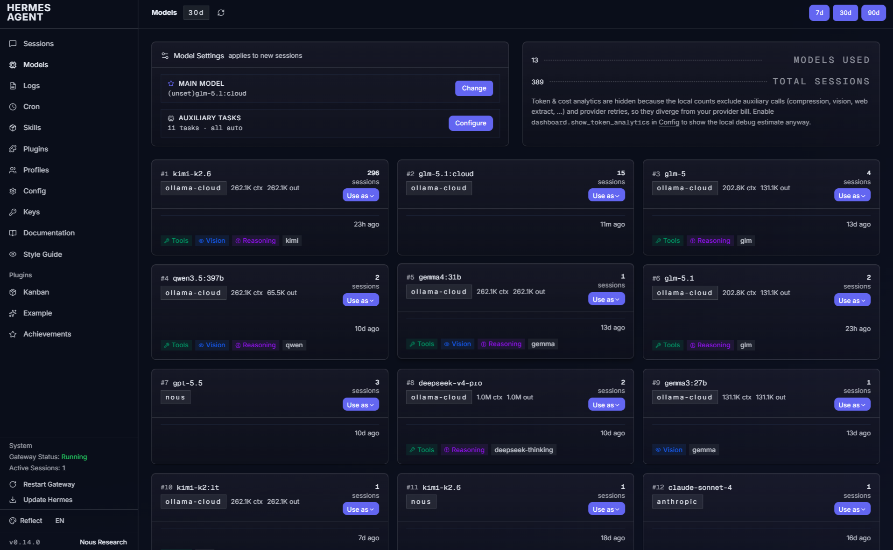
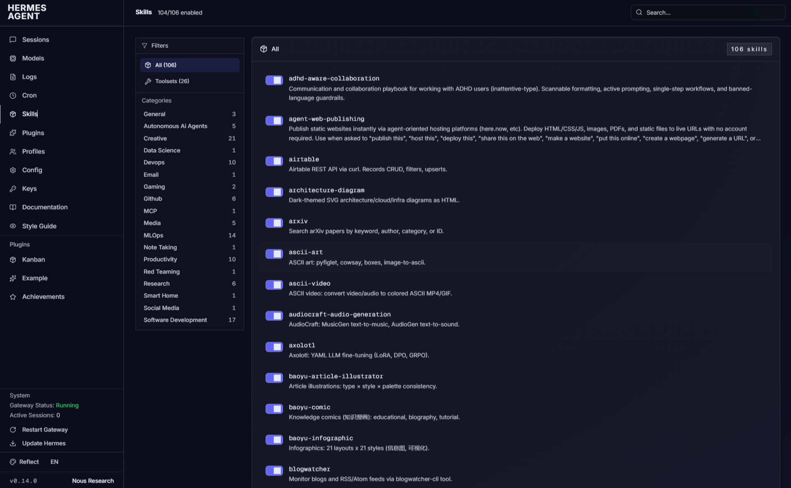
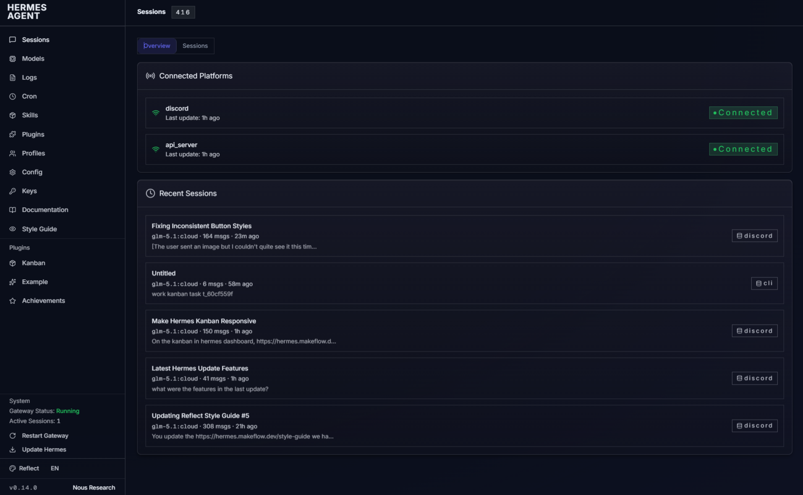
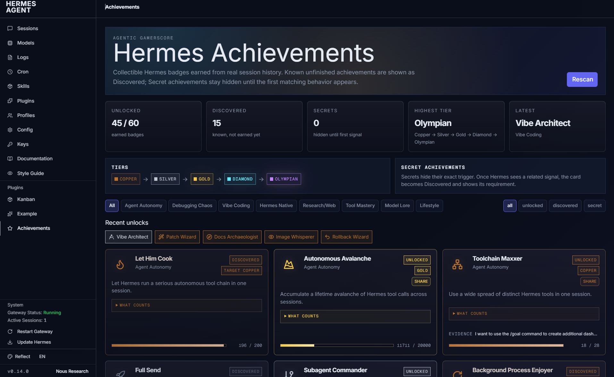
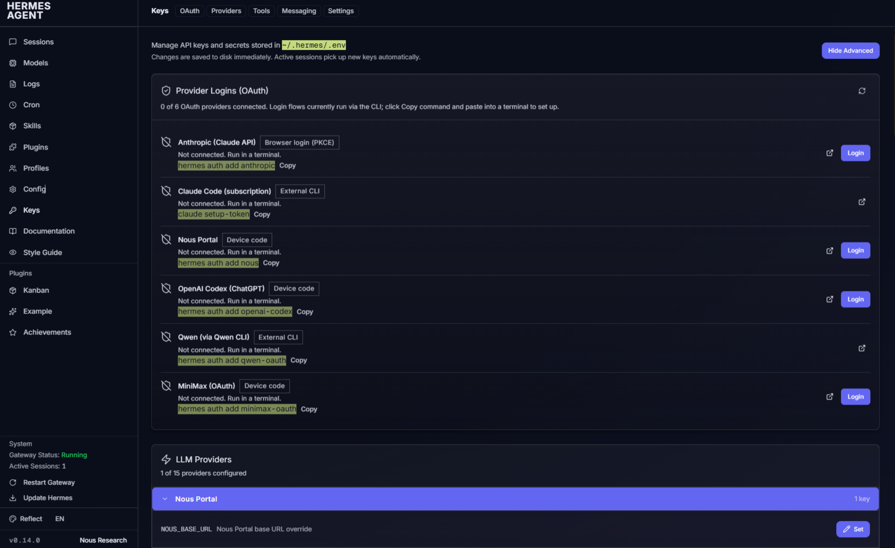
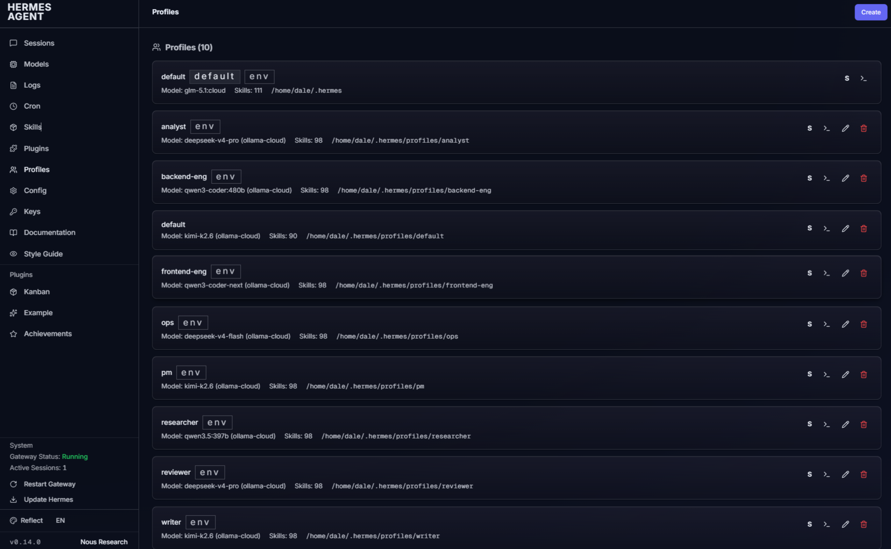
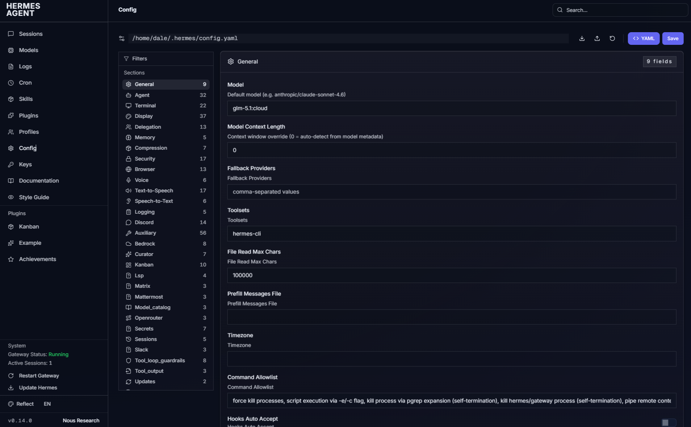
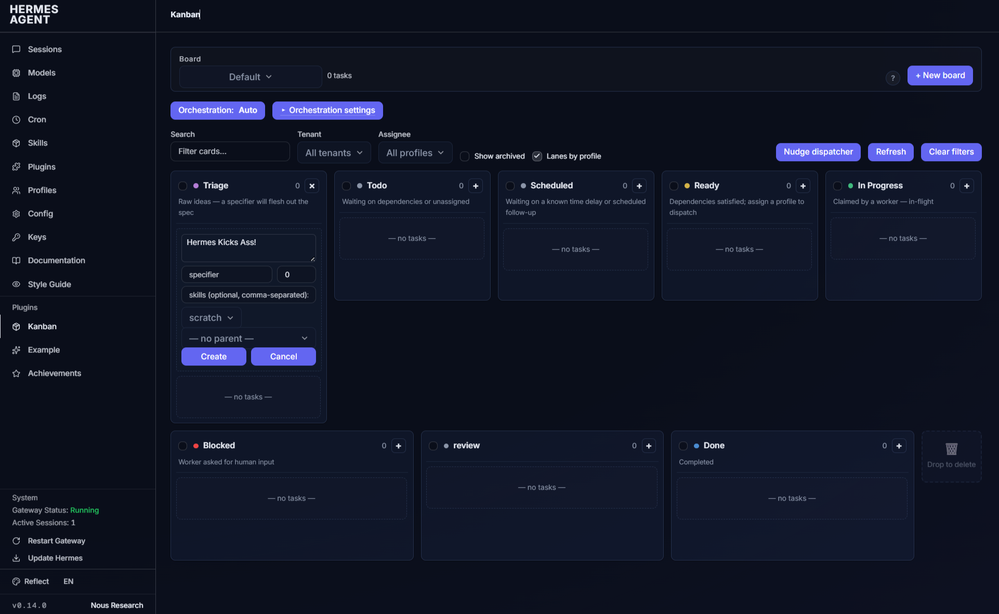

# Hermes Dashboard Theme — Reflect

A premium dark theme for the [Hermes Agent](https://github.com/NousResearch/hermes-agent) web dashboard. Deep navy surfaces with indigo-violet accents, aurora bloom behind hero content, and subtle film grain for depth.

## Preview

### Sessions


### Analytics


### Cron


### Kanban


### Config


### Skills


### Logs


### Style Guide


See the full interactive style guide at `<your-dashboard-url>/style-guide` after installing.

## Install

1. Download `reflect.yaml` into your dashboard themes directory:

```bash
mkdir -p ~/.hermes/dashboard-themes
curl -o ~/.hermes/dashboard-themes/reflect.yaml https://raw.githubusercontent.com/daletkc/hermes-theme-reflect/main/reflect.yaml
```

2. Select the theme in your dashboard — it appears as **"Reflect"** in the theme switcher immediately. No restart needed.

   Or set it via config:
   ```bash
   hermes config set dashboard.theme reflect
   ```

## Uninstall

```bash
rm ~/.hermes/dashboard-themes/reflect.yaml
```

Switch to a built-in theme first if Reflect was active:
```bash
hermes config set dashboard.theme default
```

## Design Language

| Token | Value | Usage |
|-------|-------|-------|
| Background | `#0A0E1A` | Page background |
| Surface 1 | `#11182A` | Cards, panels |
| Surface 2 | `#151D32` | Elevated surfaces |
| Surface 3 | `#1B2740` | Borders, dividers |
| Primary | `#6366f1` | Indigo — buttons, links, focus rings |
| Accent | `#8b5cf6` | Violet — highlights, hover states |
| Foreground | `#E6EAF2` | Primary text |
| Muted | `#8B95A8` | Secondary text |
| Font | Inter + Geist Mono | Body + monospace |

### Signature effects

- **Aurora bloom** — animated radial-gradient overlay on `body::before` using oklch color stops. Slow, subtle drift via CSS keyframes.
- **Film grain** — SVG noise texture on `body::after` at 3.5% opacity. Kills gradient banding on dark surfaces.
- **Glass cards** — Cards use gradient backgrounds with `backdrop-filter: blur(12px)` and inset top highlights.
- **Elevation on hover** — Cards lift 2px on hover with animated shadow transition.
- **Respects `prefers-reduced-motion`** — All animations and transitions are suppressed automatically.

### Kanban styling

The theme includes comprehensive overrides for the Hermes Kanban plugin:
- Cards with accent borders on hover, rounded corners, elevation shadows
- Outlined dropdown/select triggers (not solid primary)
- Primary buttons for actions, with accent hover
- Responsive column layout on mobile (<768px)

## Font Loading

The theme loads **Inter** (weights 300–700) and **Geist Mono** (weights 400–600) from Google Fonts via the `fontUrl` field. If you're running the dashboard behind a firewall without outbound internet:

1. Host the fonts locally on your reverse proxy
2. Update `fontUrl` in the YAML to point to your local font CSS

## Customization

The theme is a single YAML file. Edit it directly:

- **Palette**: Change `palette.background.hex`, `palette.foreground.hex`, etc.
- **Accent colors**: Change `colorOverrides.primary`, `colorOverrides.accent`
- **Aurora**: Modify the `customCSS` section — the `body::before` gradient block
- **Grain**: Adjust `body::after` opacity (currently `0.035`) or remove the block
- **Typography**: Change `typography.fontSans`, `typography.baseSize`
- **Spacing density**: Change `layout.density` to `compact` or `spacious`
- **Layout variant**: Change `layout.layoutVariant` to `cockpit` or `tiled`

All CSS custom properties defined in the `:root` block of `customCSS` are available throughout the dashboard — cards, shadows, badges, and component overrides reference them.

## Compatibility

- **Hermes Agent** v0.60+ (theme system introduced in the dashboard refactor)
- **Dashboard plugin system** — works with all built-in pages and community plugins
- **Kanban plugin** — includes dedicated Kanban overrides

## License

MIT — use freely, modify, share. Attribution appreciated but not required.

## Credits

Theme by Dale Thomas / ActionableOps.